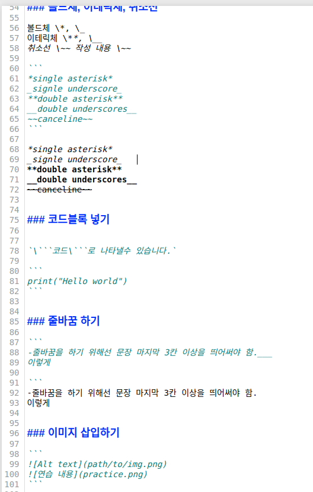

# first-repository
add new contents

mark down practice

# This is a H1
## This is a H2
### This is a H3
#### This is a H4


1. first
2. second
3. third

- red
- green
- blue


### 구분선 긋기
```
---
```

---


### 하이퍼 링크 걸기

```
[내 블로그](http://throwexception.tistory.com)
```

[내 블로그](http://throwexception.tistory.com)


### 인라인 블록 작성하기

인라인 블록 

```
`적을 내용`
```

`적고자 하는 내용`


### 볼드체, 이테릭체, 취소선

볼드체 \*, \_
이테릭체 \**, \__
취소선 \~~ 작성 내용 \~~

```
*single asterisk*
_signle underscore_
**double asterisk**
__double underscores__
~~canceline~~
```

*single asterisk*   
_signle underscore_   
**double asterisk**   
__double underscores__   
~~canceline~~   


### 코드블록 넣기


`\```코드\```로 나타낼수 있습니다.`

```
print("Hello world")
```


### 줄바꿈 하기

```
-줄바꿈을 하기 위해선 문장 마지막 3칸 이상을 띄어써야 함.___
이렇게

```
-줄바꿈을 하기 위해선 문장 마지막 3칸 이상을 띄어써야 함.   
이렇게


### 이미지 삽입하기

```


```

